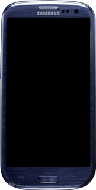
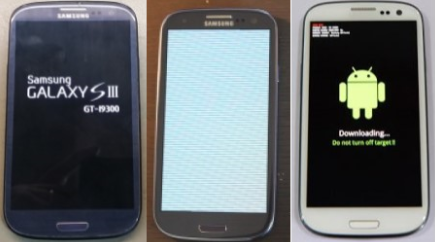

**Choose your "type of brick" :**

## [Type 1](Type-1-Brick.md)

Your phone is completely dead.

## [Type 2](Type-2-Brick.md)
Your phone boots up but hangs on the Samsung logo and boots into download mode or shows a corrupted white screen and boots into download mode. 

## [Type 3](Type-3-Brick.md)

Your phone boots up but hangs on the Samsung logo or shows a corrupted white screen and boots into download mode, but it has an incompatible bootloader version with the tool (follow type 2, you'll see when it's incompatible).

