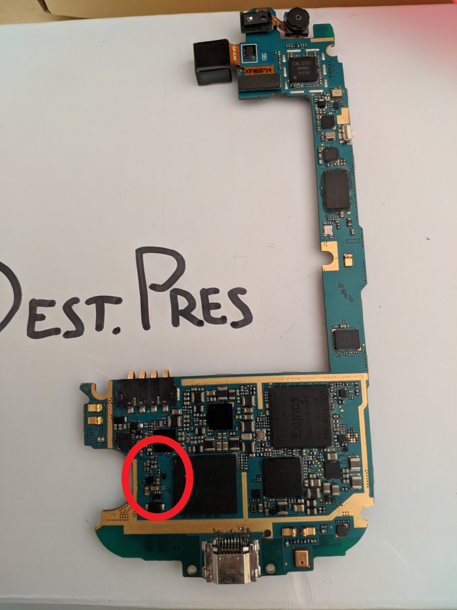
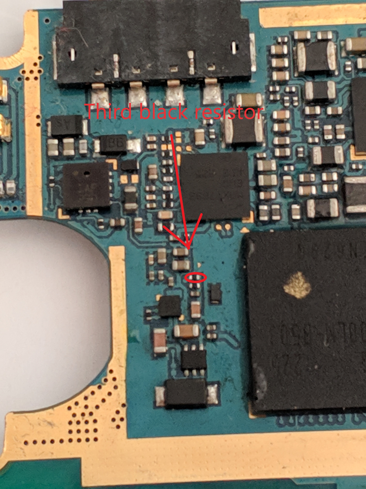
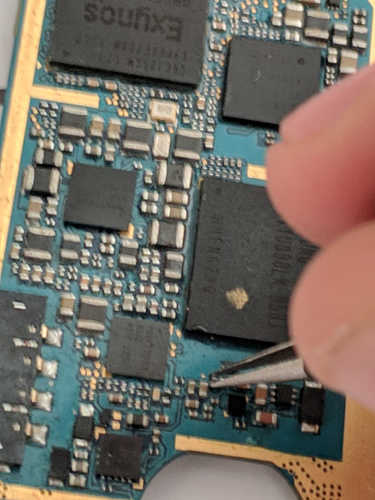

Insert the micro SD card into your computer. We're going to create the **SBOOT SD card**.

**For Linux** run the following commands and replace YOURMICROSD with your SD card mountpoint:

* `cd sdcard`

* `sudo dd if=sbootsdcard.bin of=YOURMICROSD`

* `cd -`

**For Windows** double click on "OpenCommandPromptHere.cmd" then do/type the following:

* Open balenaEtcher, select "sbootsdcard.bin" as the image from the i9300_emmc_toolbox/sdcard folder, select your SD card as the drive and click flash.

**Now do the following:**

1. Insert the **SD card** to your device [**and SHORT THE RESISTOR**](#how-to-short-the-resistor), insert the battery, press power. 

2. Connect the usb cable.

3. Run the following command in order to low-level format the eMMC and install the new firmware: 
 **Linux**:`exploit/sboot_exploit.py --shellcode shellcode/write_fw.bin -e 0xf7bugfree.bin`
 **Windows**:`python exploit/sboot_exploit.py --shellcode shellcode/write_fw.bin -e 0xf7bugfree.bin`

4. Boot again to download mode with the SBOOT SD card still inside the phone and connect the usb cable. You might see some funky stuff on the phone's screen -- just ignore it.

5. Resize the boot partition:  
**Linux**:`exploit/sboot_exploit.py --shellcode shellcode/change_boot_partition_size.bin`
**Windows**:`python exploit/sboot_exploit.py --shellcode shellcode/change_boot_partition_size.bin`

6. Insert the micro SD card into your computer. We're going to create the **RECOVERY SD card**:
**Windows**: Open balenaEtcher, select "RECOVERYSDCARD.bin" as the image from the "i9300_emmc_toolbox" folder, select your SD card as the drive and click flash. 
**Linux**: Perform on the directory "i9300_emmc_toolbox" `dd if=RECOVERYSDCARD.bin of=/dev/path to SD card device (mountpoint on gparted)`.

7. Put the **RECOVERY SD card** in your phone. Then boot it normally. A screen with SDCARD MODE should appear. When it's done take the battery out.

eMMC is functional! Now go to [reinstalling Android](Reinstalling-Android.md)

### How to short the resistor
You will need to take apart your phone and short a resistor on the motherboard. I recommend this guide: [Samsung Galaxy S III Motherboard Replacement
](https://www.ifixit.com/Guide/Samsung+Galaxy+S+III+Motherboard+Replacement/12696)

**This is difficult as you have to have the display connector plugged in (maybe it works without the display, you can try and report back), as well as the battery, but to make it easier you can try to set the open the motherboard to a side like a book and then tape the battery to the motherboard**

Your motherboard should look like this (we are going to focus on the red section):

This is the resistor that we need to short with tweezers while powering on the phone to boot in SD card mode 

Short:

